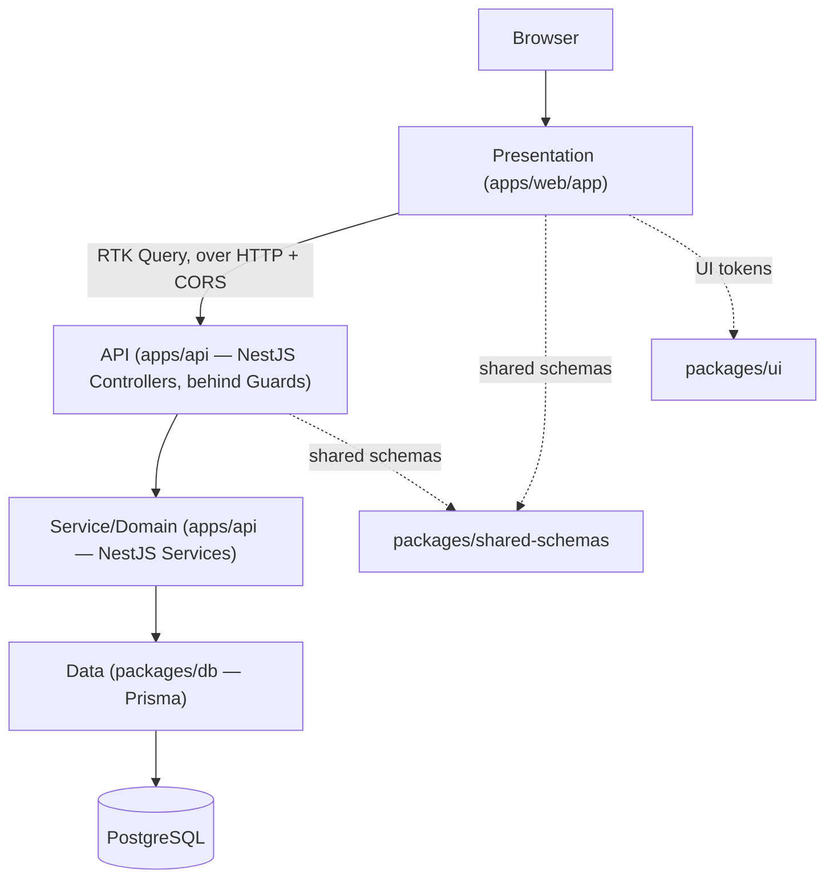
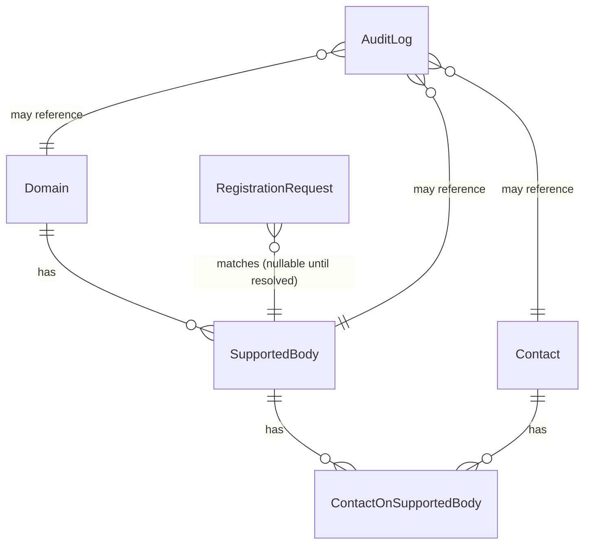

# Architecture Spine — Contact Management MVP

## Design Paradigm

**Client/server split**, four layers, dependency direction strictly top-to-bottom (a layer may only depend on the layer below it, never sideways, never upward) — the same four layers as before, now split across two independently deployed applications instead of one (AD-1):

| Layer | Lives in | Role |
| --- | --- | --- |
| Presentation | `apps/web/app/**` (Next.js, React Server/Client Components) | Renders screens; Server Components fetch data by calling the API layer over HTTP (`lib/api-client.ts`) — they do **not** talk to `packages/db`, directly or otherwise, since `packages/db` isn't reachable from `apps/web` at all. Client Components own interaction and call the API layer via RTK Query. |
| API | `apps/api/src/<resource>/*.controller.ts` (NestJS Controllers) | The *only* mutation and cross-cutting-concern boundary: validation (Pipes), authorization (Guards), response shaping (Interceptors/Filters), OpenAPI annotation (`@nestjs/swagger`). Thin — parses, validates, calls Service/Domain, responds. |
| Service/Domain | `apps/api/src/<resource>/*.service.ts` | Business rules (e.g. registration-approval state machine, domain-scope resolution). Pure where possible; the only layer allowed to call `packages/db`. |
| Data | `packages/db` (Prisma schema, client, extensions) | Schema, migrations, the audit and domain-scope extensions. Owns the only `PrismaClient` instance in the system — reachable only from `apps/api`. |

Cross-cutting, not a layer: `packages/shared-schemas` (Joi + DTOs, imported by `apps/web` for RHF validation and by `apps/api` for Pipe-based validation — one validation source of truth on both sides of a real network boundary now, not just two layers of one app) and `packages/ui` (Mantine wrappers/tokens, consumed only by `apps/web`). A future fully-separate public-facing app (Phase 2+, see Deferred) would consume the same `packages/*` and the same `apps/api` — this is why the layering is package-enforced now, before a third app exists.



**What changed from a single combined app:** the Presentation→API boundary used to be an in-process function call (a Server Component invoking `packages/db` directly, or an RTK Query call to a Route Handler in the same Next.js process). It is now a genuine network call between two separately deployed applications, on different origins — see AD-1 and AD-12.

## Invariants & Rules

### AD-1 — Client (`apps/web`) and server (`apps/api`) are separate applications [ADOPTED, supersedes the single-app framing this AD originally described]
- **Binds:** all
- **Prevents:** presentation code and business/data-access code coupling to the point where they can only run in the same process — and shared logic getting written once inside one app and duplicated/rewritten when a second consumer appears.
- **Rule:** the product is two independently built and deployed applications: `apps/web` (Next.js — presentation only, no Route Handlers, no `packages/db` access) and `apps/api` (NestJS — the entire API + Service/Domain + the only consumer of `packages/db`). `apps/web` reaches `apps/api` only over HTTP, through `apps/web/lib/api-client.ts` (see AD-12). All business logic, validation, and data access live in `apps/api`/`packages/*`, never written directly inside `apps/web`. The public self-registration UI (`(public)/register`) is a route group inside `apps/web`, not a separate app, for this MVP — see Deferred for a possible future third app.

### AD-2 — Next.js App Router, not Pages Router
- **Binds:** `apps/web`
- **Prevents:** two routing paradigms coexisting in one app.
- **Rule:** every route uses App Router conventions. Server Components are the default; `"use client"` only at the smallest interactive leaf (full decision rule + examples: `expertise-react-nextjs`). Server Components fetch data by calling `apps/api` through `lib/api-client.ts` (AD-12) — never by importing `packages/db`, which `apps/web` cannot reach.

### AD-3 — Mutations go through the API, never Server Actions
- **Binds:** `apps/web` (Presentation ↔ API boundary)
- **Prevents:** the same action (e.g. approving a registration request) being reachable through two undocumented, independently-evolving paths — found as a live contradiction during implementation planning and closed here. Now doubly true: `apps/web` has no Prisma access, so a Server Action attempting a real data mutation has no data layer to reach anyway.
- **Rule:** every data mutation is a NestJS controller endpoint in `apps/api`, called from the client via an RTK Query mutation hook (`lib/api-client.ts`). A `"use server"` Server Action is permitted only for a mutation with no reason to ever appear in the documented API and no data-layer access requirement (rare; treat as an exception requiring justification, not a default).

### AD-4 — Domain-scoped authorization is centralized
- **Binds:** every API endpoint
- **Prevents:** a forgotten per-endpoint permission check silently exposing one coordinator's domain data to another.
- **Rule:** a global NestJS Guard in `apps/api` (registered via `APP_GUARD` in `app.module.ts`, not per-controller) enforces authentication and domain-scope before any controller method body runs. A controller adds only the narrow resource-level check the central Guard structurally can't express (e.g. "only the assigned coordinator may approve this specific request") — never a duplicate of the domain check itself. (This replaces the single-app design's `proxy.ts`/`middleware.ts` — there is no Next.js middleware layer in `apps/web` for this, since `apps/web` never receives the request that needs authorizing.)

### AD-5 — Audit trail is automatic and transaction-safe
- **Binds:** `packages/db`, every mutating model
- **Prevents:** a new endpoint silently shipping without audit coverage; an audit row diverging from the mutation it describes on a crash.
- **Rule:** one Prisma Client Extension, applied once in `packages/db`, is the only sanctioned `PrismaClient` export. It writes audit rows through `Prisma.getExtensionContext(this)` so a single-model mutation's audit row shares that mutation's transaction automatically. Any operation spanning more than one model is wrapped in an explicit `prisma.$transaction(async (tx) => …)` at the call site (mechanism + code: `expertise-postgres-prisma`).

### AD-6 — Domain-scoped queries use one named function per model, never a generic filter
- **Binds:** `packages/db` consumers
- **Prevents:** a one-size-fits-all `where: { domainId }` helper silently mis-scoping (or throwing on) a model that reaches its domain through a relation instead of a direct column — a real bug caught in this project's `Contact` model (domain reached via `SupportedBody`, not a direct field).
- **Rule:** each domain-scoped model gets its own `scopeX(args, domainId)` function, type-checked against that model's actual `WhereInput`. No generic cross-model scoping helper.

### AD-7 — Soft delete only, for any entity with a preserved-history requirement
- **Binds:** `Contact` now; any future entity the PRD marks the same way
- **Prevents:** losing the historical record the PRD explicitly requires (CM-3) via an irreversible hard delete.
- **Rule:** never call `.delete()` on a soft-delete entity. "Delete" from the UI sets a status field (`INACTIVE`) plus a timestamp; default list/lookup queries filter to the active state through one shared helper, not a repeated inline filter.

### AD-8 — One validation entry point, one response envelope
- **Binds:** every API endpoint
- **Prevents:** endpoints drifting to different validation styles or ad hoc response shapes, breaking generic client-side error handling (RHF `setError`, RTK Query error discrimination).
- **Rule:** every mutating endpoint validates through a shared NestJS Pipe (`apps/api/src/common/pipes/joi-validation.pipe.ts`) wrapping the same Joi schema from `packages/shared-schemas` that `apps/web` uses client-side; every response (success and error) is shaped through a shared global Interceptor (success: `{ data, meta? }`) and Exception Filter (error: `{ error: { code, message, details? } }`) registered once in `apps/api/src/main.ts` — never an ad hoc per-controller shape. The envelope's wire shape is unchanged from the single-app design; only the mechanism producing it moved from a Next.js HOF wrapper to NestJS Pipes/Interceptors/Filters. Full shapes: `expertise-api-rest`.

### AD-9 — Auth is provider-agnostic by construction [NEEDS RE-DECISION — see Deferred]
- **Binds:** all
- **Prevents:** session/route-protection code hardcoding assumptions that only hold for a Credentials-based login, forcing a rewrite if organizational SSO is adopted later.
- **Rule:** the intent (provider-agnostic auth, Credentials for MVP, SSO later as config-only) still stands, but **Auth.js (NextAuth) itself is a Next.js-specific library and no longer fits cleanly now that `apps/api` — not `apps/web` — is where authentication must actually be enforced** (AD-4's Guard runs in NestJS, not Next.js). This wasn't re-decided as part of the client/server split and needs one: the NestJS-idiomatic equivalents are Passport.js strategies (`@nestjs/passport`) or `@nestjs/jwt`, with `apps/web` holding only the client-side session UI, not the enforcement. No login exists yet in Epic 1 (open access, by product decision) — resolve this before Epic 3 (domain/permissions) is built, not before.

### AD-10 — Server data never gets duplicated into plain Redux state
- **Binds:** `apps/web` Presentation layer
- **Prevents:** two sources of truth for the same data (a plain Redux slice manually synced with what RTK Query already caches) drifting apart.
- **Rule:** anything sourced from the database is owned by RTK Query (cache, invalidation, loading/error state), with its `baseQuery` pointed at `apps/api`'s origin (see AD-12). Plain Redux slices hold only genuinely global, client-only state (session, cross-screen UI prefs). Full state-placement decision rule: `expertise-react-nextjs`.

### AD-11 — Dependency direction: apps depend on packages, never the reverse
- **Binds:** the whole monorepo
- **Prevents:** a `packages/*` module importing from `apps/web` or `apps/api`, which would silently couple a supposedly-shared package to one app.
- **Rule:** `packages/db`, `packages/shared-schemas`, `packages/ui` have zero imports from any `apps/*` directory. Turborepo's task graph and each package's own `package.json` dependencies are the enforcement point — a package importing an app is a build-graph violation, not just a style issue. (Unchanged in substance from the single-app design — `apps/*` now means two apps instead of one, the rule itself doesn't change.)

### AD-12 — `apps/web` reaches `apps/api` only through one HTTP client layer, with CORS explicitly enabled [ADOPTED]
- **Binds:** `apps/web` (all data access), `apps/api` (`main.ts` bootstrap)
- **Prevents:** individual components each hand-rolling `fetch` calls with a hardcoded API origin, and CORS being discovered as a bug in production instead of configured deliberately.
- **Rule:** every call from `apps/web` to `apps/api` goes through `apps/web/lib/api-client.ts` (the base for RTK Query's `baseQuery` and for the `fetch` calls Server Components make during SSR) — never an inline `fetch(...)` scattered in a component. `apps/api/src/main.ts` calls `app.enableCors(...)` explicitly, scoped to `apps/web`'s known origin(s) (not `*`), not left to a generic middleware file. This is the direct structural cost of AD-1's split — see `expertise-api-rest` and `expertise-react-nextjs` for the concrete wiring.

## Consistency Conventions

| Concern | Convention |
| --- | --- |
| Naming (entities, files, interfaces, events) | Prisma models PascalCase singular (`Contact`, `SupportedBody`); DB columns `snake_case` via `@map`; TS files/functions per `expertise-nodejs-typescript`; status-like fields as `as const` object unions, never TS `enum`. |
| Data & formats (ids, dates, error shapes, envelopes) | IDs: `cuid()`. Dates: Prisma `DateTime`, ISO-8601 over the wire. Success envelope `{ data, meta? }`; error envelope `{ error: { code, message, details? } }` (`expertise-api-rest`). Hebrew/RTL is the only supported locale for MVP — no i18n scaffolding. |
| State & cross-cutting (mutation, errors, logging, config, auth) | Mutations: RTK Query → NestJS controller endpoint in `apps/api` only (AD-3), reached through `apps/web/lib/api-client.ts` (AD-12). Errors: never swallowed, never leaked to the client (`expertise-nodejs-typescript`, `expertise-code-quality`). Config/secrets: env vars only, validated at startup. Auth: needs re-decision, see AD-9. Authorization: global NestJS Guard in `apps/api` (AD-4). Audit: Prisma extension (AD-5). |

## Stack

| Name | Version |
| --- | --- |
| Node.js | LTS at build time — verify `package.json`/`.nvmrc` (`expertise-nodejs-typescript`) |
| TypeScript | Strict baseline per `expertise-nodejs-typescript` — verify installed major |
| Next.js | App Router, `apps/web` — presentation only, no Route Handlers (AD-1) — verify installed major (`expertise-react-nextjs`) |
| NestJS | `apps/api` — the entire API + Service/Domain layer (AD-1) — verify installed major (`expertise-api-rest`) |
| React | Verify installed major |
| Mantine | 7+ assumed (CSS Modules RTL) — verify before relying on `DirectionProvider` setup |
| Redux Toolkit + RTK Query | `baseQuery` targets `apps/api`'s origin (AD-12) |
| React Hook Form + `@hookform/resolvers/joi` | — |
| PostgreSQL | accessed via `pg` (Prisma's `PrismaPg` driver adapter), only from `apps/api` |
| Prisma | 7+ required (`$use` removed; Client Extensions only) |
| Joi | shared between `apps/web` (RHF) and `apps/api` (NestJS Pipe) via `packages/shared-schemas` |
| Jest + React Testing Library (`apps/web`) / `@nestjs/testing` (`apps/api`) | — |
| Turborepo + npm workspaces | npm, not pnpm/yarn — explicit project decision |
| GitLab (`.gitlab-ci.yml`) | CI/CD — explicit project decision |
| Auth | provider TBD — see AD-9, needs re-decision now that enforcement lives in `apps/api` (NestJS), not `apps/web` (Next.js) |
| `@nestjs/swagger` | OpenAPI generation for `apps/api` — decorator-based, native to NestJS (supersedes the `next-openapi-gen`/JSDoc approach, which only applied to Next.js Route Handlers) |
| `@nestjs/throttler` | Recommended for the public registration endpoint's rate limiting — NestJS-native Guard-based approach; not yet confirmed with stakeholder |

## Structural Seed

```text
contact-management/
  apps/
    web/                       # MVP — Next.js, presentation only (AD-1)
      app/
        (internal)/             # coordinator/admin routes
        (public)/register/      # public self-registration UI (form only — calls apps/api)
        layout.tsx
      components/<resource>/    # feature-scoped UI
      lib/
        api-client.ts           # the only way apps/web reaches apps/api (AD-12)
        hooks/
        store.ts
    api/                        # MVP — NestJS, the entire API + Service/Domain layer (AD-1)
      src/
        main.ts                 # bootstrap; app.enableCors(...) here (AD-12)
        app.module.ts            # root module — imports every resource module
        <resource>/
          <resource>.module.ts
          <resource>.controller.ts  # API layer — thin, parses/validates/responds
          <resource>.service.ts     # Service/Domain layer — the only code allowed to call packages/db
        common/
          pipes/joi-validation.pipe.ts  # wraps packages/shared-schemas Joi schemas (AD-8)
  packages/
    db/                         # Prisma schema, client, audit + domain-scope extensions (AD-5, AD-6) — reachable only from apps/api
    shared-schemas/             # Joi schemas + DTOs, imported by apps/web (RHF) and apps/api (Pipes)
    ui/                         # Mantine tokens/wrappers (DESIGN.md) — consumed only by apps/web
    config/                     # shared tsconfig/eslint base
  docs/                         # project-facing documentation (this repo's existing convention)
  _bmad-output/                 # BMAD planning artifacts (this repo's existing convention)
  .gitlab-ci.yml                # CI/CD pipeline — build+test for apps/web and apps/api separately
  turbo.json                    # task graph (build/dev/lint) across apps/+packages/
```



Full field-level schema, the audit extension, and the domain-scope functions: `expertise-postgres-prisma` (canonical patterns to establish on first implementation — no code exists under `apps/`/`packages/` yet).

**Deployment & environments:** local development runs PostgreSQL via Docker (adopted); `apps/web` and `apps/api` run as two separate local processes/ports. Production hosting (Vercel/serverless vs. self-hosted Docker) is explicitly undecided — see Deferred. Until resolved, no NestJS controller/service or `packages/db` code may depend on a provider-specific API (e.g. a Vercel-only storage SDK) that would foreclose either target. CI/CD is GitLab (`.gitlab-ci.yml`) — adopted, not deferred.

## Deferred

- **Production hosting target** (Vercel/serverless vs. self-hosted Docker vs. other) — user's explicit choice to decide later. Revisit before first production deploy; now also decides *two* deployables (`apps/web`, `apps/api`) instead of one, which may not need the same target. Until then, AD-11 and the "no provider lock-in" rule above keep both apps portable to either.
- **File storage for public-registration document uploads** (local disk vs. S3-compatible object storage) — linked to the hosting decision above; decide together.
- **Auth provider and mechanism** — see AD-9: Auth.js no longer fits now that enforcement lives in `apps/api` (NestJS); needs a fresh decision (likely Passport.js/`@nestjs/jwt`) before Epic 3 (domain/permissions) is built. Specific SSO identity provider (Microsoft/Google/AD vs. Credentials) still separately unknown (org IT status).
- **A third, fully-separate public-facing app** — the public registration UI is a route group inside `apps/web` for this MVP (AD-1), not its own app. Extracting it later (if ever needed) is the same kind of move AD-1's package boundaries already prepare for.
- **Postgres Row-Level Security** as an alternative to AD-4/AD-6's application-layer domain scoping — revisit only if a second direct DB consumer (a reporting tool, another service) appears.
- **API versioning (`/api/v1/`)** — not needed while the only consumers are `apps/web` and one fixed-contract public endpoint; trigger conditions documented in `expertise-api-rest`.
- **Rate-limiting configuration** (`@nestjs/throttler` recommended, see Stack) — flagged as the current best pick in `expertise-api-rest`, not yet stakeholder-confirmed the way the AD-numbered decisions above are.
