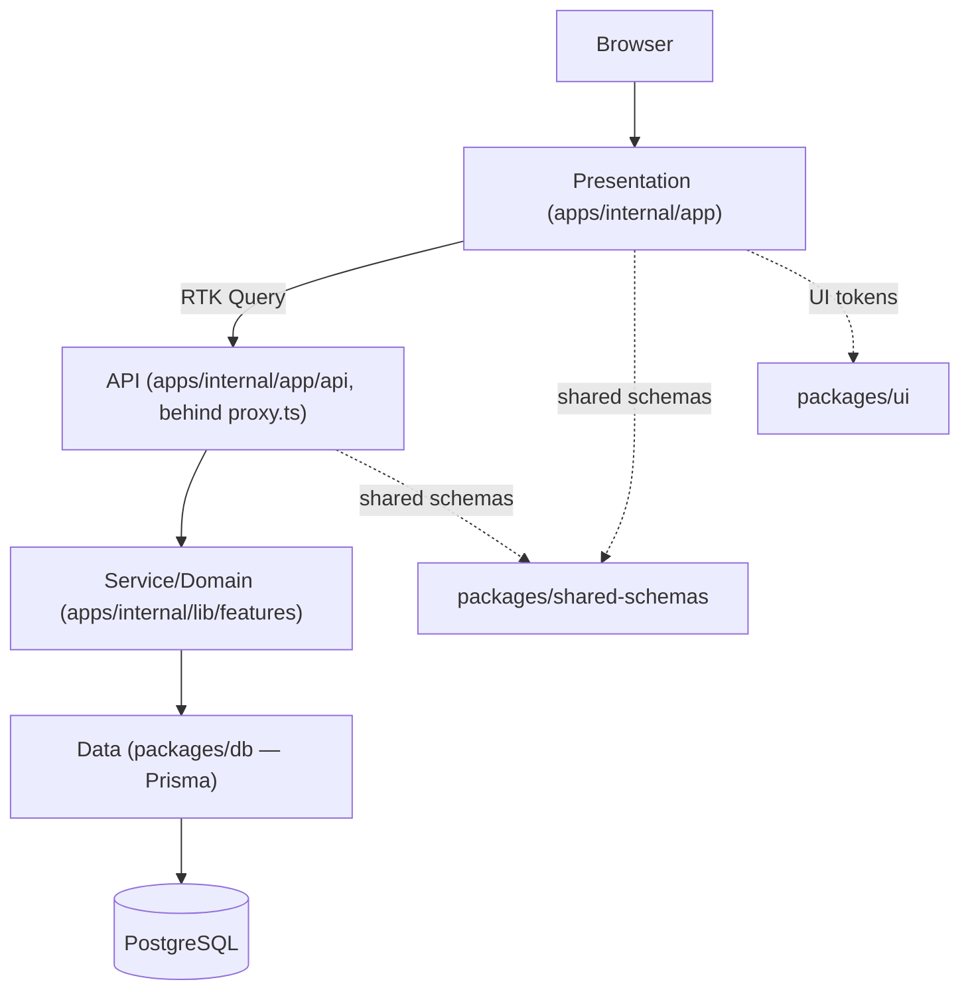
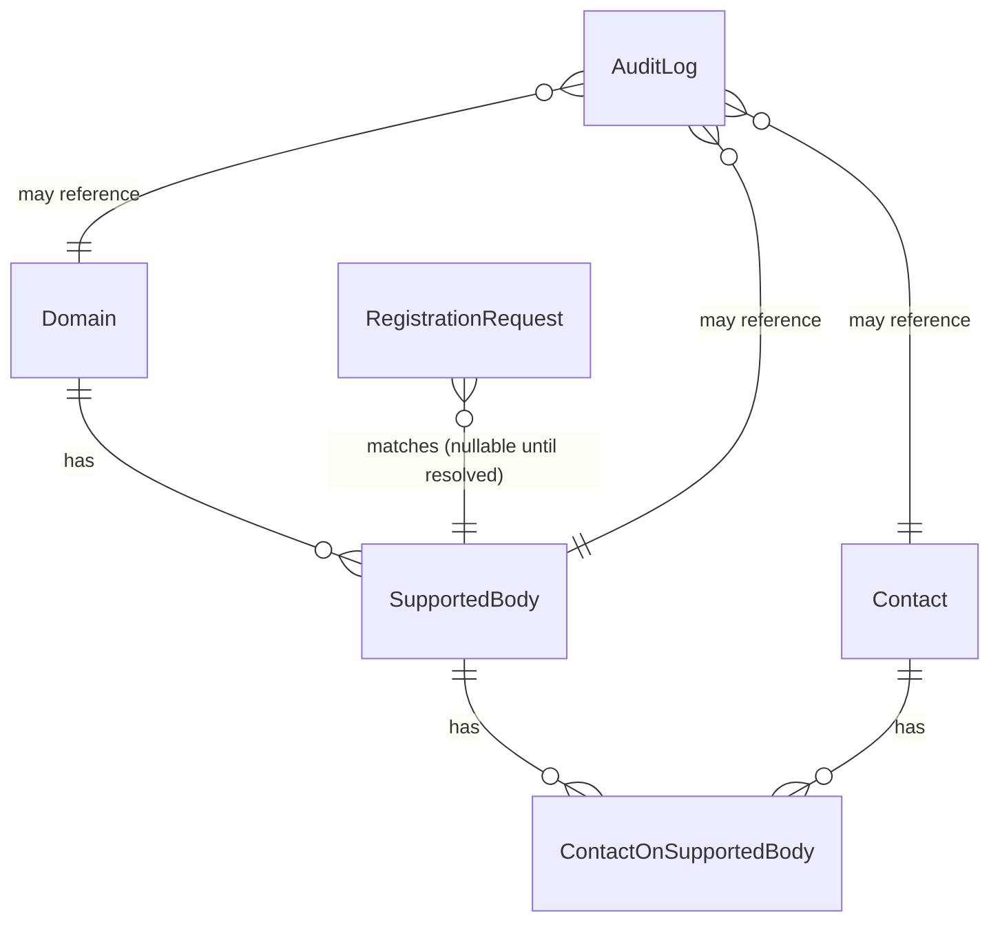

# Architecture Spine — Contact Management MVP

## Design Paradigm

**Layered modular monolith**, four layers, dependency direction strictly top-to-bottom (a layer may only depend on the layer below it, never sideways into another app, never upward):

| Layer | Lives in | Role |
| --- | --- | --- |
| Presentation | `apps/internal/app/**` (React Server/Client Components) | Renders screens; Server Components read data directly, Client Components own interaction and call the API layer via RTK Query. Never talks to `packages/db` directly. |
| API | `apps/internal/app/api/**` (Route Handlers) | The *only* mutation and cross-cutting-concern boundary: validation, authorization is already enforced upstream by `proxy.ts`, response shaping, OpenAPI annotation. Thin — parses, validates, calls Service/Domain, responds. |
| Service/Domain | `apps/internal/lib/features/<resource>/**` | Business rules (e.g. registration-approval state machine, domain-scope resolution). Pure where possible; the only layer allowed to call `packages/db`. |
| Data | `packages/db` (Prisma schema, client, extensions) | Schema, migrations, the audit and domain-scope extensions. Owns the only `PrismaClient` instance in the system. |

Cross-cutting, not a layer: `packages/shared-schemas` (Joi + DTOs, imported by both Presentation and API for one validation source of truth) and `packages/ui` (Mantine wrappers/tokens). `apps/public` (Phase 2+, not built in this MVP) will consume the same `packages/*` — this is why the layering is package-enforced now, before a second app exists.



## Invariants & Rules

### AD-1 — Two-app target, one app built now [ADOPTED]
- **Binds:** all
- **Prevents:** shared logic getting written once inside `apps/internal` and duplicated/rewritten when `apps/public` is built later.
- **Rule:** the product ships as two Next.js apps long-term (`apps/internal` for coordinators/super-admin, `apps/public` for the anonymous registration form — Phase 2+). Only `apps/internal` is built for this MVP. All business logic, validation, and data access live in `packages/*`, never written directly inside an app, so `apps/public`'s eventual creation adds a thin presentation shell, not a rewrite.

### AD-2 — Next.js App Router, not Pages Router
- **Binds:** `apps/internal`
- **Prevents:** two routing paradigms coexisting in one app.
- **Rule:** every route uses App Router conventions. Server Components are the default; `"use client"` only at the smallest interactive leaf (full decision rule + examples: `expertise-react-nextjs`).

### AD-3 — Mutations go through the REST API, never Server Actions
- **Binds:** `apps/internal` (Presentation ↔ API boundary)
- **Prevents:** the same action (e.g. approving a registration request) being reachable through two undocumented, independently-evolving paths — found as a live contradiction during implementation planning and closed here.
- **Rule:** every data mutation is a Route Handler under `app/api/**`, called from the client via an RTK Query mutation hook. A `"use server"` Server Action is permitted only for a mutation with no reason to ever appear in the documented API (rare; treat as an exception requiring justification, not a default).

### AD-4 — Domain-scoped authorization is centralized
- **Binds:** every API route
- **Prevents:** a forgotten per-endpoint permission check silently exposing one coordinator's domain data to another.
- **Rule:** `proxy.ts` (Next.js's renamed `middleware.ts`) enforces authentication and domain-scope before any Route Handler body runs. A route adds only the narrow resource-level check the central layer structurally can't express (e.g. "only the assigned coordinator may approve this specific request") — never a duplicate of the domain check itself.

### AD-5 — Audit trail is automatic and transaction-safe
- **Binds:** `packages/db`, every mutating model
- **Prevents:** a new endpoint silently shipping without audit coverage; an audit row diverging from the mutation it describes on a crash.
- **Rule:** one Prisma Client Extension, applied once in `packages/db`, is the only sanctioned `PrismaClient` export. It writes audit rows through `Prisma.getExtensionContext(this)` so a single-model mutation's audit row shares that mutation's transaction automatically. Any operation spanning more than one model is wrapped in an explicit `prisma.$transaction(async (tx) => …)` at the call site (mechanism + code: `expertise-postgres-prisma`).

### AD-6 — Domain-scoped queries use one named function per model, never a generic filter
- **Binds:** `packages/db` consumers
- **Prevents:** a one-size-fits-all `where: { domainId }` helper silently mis-scoping (or throwing on) a model that reaches its domain through a relation instead of a direct column — a real bug caught in this project's `Contact` model (domain reached via `SupportedBody`, not a direct field).
- **Rule:** each domain-scoped model gets its own `scopeX(args, domainId)` function, type-checked against that model's actual `WhereInput`. No generic cross-model scoping helper.

### AD-7 — Soft delete only, for any entity with a preserved-history requirement
- **Binds:** `Contact` now; any future entity the PRD marks the same way
- **Prevents:** losing the historical record the PRD explicitly requires (CM-3) via an irreversible hard delete.
- **Rule:** never call `.delete()` on a soft-delete entity. "Delete" from the UI sets a status field (`INACTIVE`) plus a timestamp; default list/lookup queries filter to the active state through one shared helper, not a repeated inline filter.

### AD-8 — One validation entry point, one response envelope
- **Binds:** every API route
- **Prevents:** routes drifting to different validation styles or ad hoc response shapes, breaking generic client-side error handling (RHF `setError`, RTK Query error discrimination).
- **Rule:** every mutating route validates through the shared Joi wrapper; every route (success and error) responds through the shared `dataResponse`/`errorResponse` envelope. Full shapes: `expertise-api-rest`.

### AD-9 — Auth is provider-agnostic by construction
- **Binds:** all
- **Prevents:** session/route-protection code hardcoding assumptions that only hold for a Credentials-based login, forcing a rewrite if organizational SSO is adopted later.
- **Rule:** Auth.js (NextAuth) is the only auth abstraction. MVP ships a Credentials provider; adding SSO later is a provider-config change, not a change to any consuming code.

### AD-10 — Server data never gets duplicated into plain Redux state
- **Binds:** `apps/internal` Presentation layer
- **Prevents:** two sources of truth for the same data (a plain Redux slice manually synced with what RTK Query already caches) drifting apart.
- **Rule:** anything sourced from the database is owned by RTK Query (cache, invalidation, loading/error state). Plain Redux slices hold only genuinely global, client-only state (session, cross-screen UI prefs). Full state-placement decision rule: `expertise-react-nextjs`.

### AD-11 — Dependency direction: apps depend on packages, never the reverse
- **Binds:** the whole monorepo
- **Prevents:** a `packages/*` module importing from `apps/internal`, which would silently couple a supposedly-shared package to one app and break the AD-1 split-later plan.
- **Rule:** `packages/db`, `packages/shared-schemas`, `packages/ui` have zero imports from any `apps/*` directory. Turborepo's task graph and each package's own `package.json` dependencies are the enforcement point — a package importing an app is a build-graph violation, not just a style issue.

## Consistency Conventions

| Concern | Convention |
| --- | --- |
| Naming (entities, files, interfaces, events) | Prisma models PascalCase singular (`Contact`, `SupportedBody`); DB columns `snake_case` via `@map`; TS files/functions per `expertise-nodejs-typescript`; status-like fields as `as const` object unions, never TS `enum`. |
| Data & formats (ids, dates, error shapes, envelopes) | IDs: `cuid()`. Dates: Prisma `DateTime`, ISO-8601 over the wire. Success envelope `{ data, meta? }`; error envelope `{ error: { code, message, details? } }` (`expertise-api-rest`). Hebrew/RTL is the only supported locale for MVP — no i18n scaffolding. |
| State & cross-cutting (mutation, errors, logging, config, auth) | Mutations: RTK Query → Route Handler only (AD-3). Errors: never swallowed, never leaked to the client (`expertise-nodejs-typescript`, `expertise-code-quality`). Config/secrets: env vars only, validated at startup. Auth: Auth.js (AD-9). Authorization: `proxy.ts` (AD-4). Audit: Prisma extension (AD-5). |

## Stack

| Name | Version |
| --- | --- |
| Node.js | LTS at build time — verify `package.json`/`.nvmrc` (`expertise-nodejs-typescript`) |
| TypeScript | Strict baseline per `expertise-nodejs-typescript` — verify installed major |
| Next.js | App Router — verify installed major (`expertise-react-nextjs`) |
| React | Verify installed major |
| Mantine | 7+ assumed (CSS Modules RTL) — verify before relying on `DirectionProvider` setup |
| Redux Toolkit + RTK Query | — |
| React Hook Form + `@hookform/resolvers/joi` | — |
| PostgreSQL | — |
| Prisma | 7+ required (`$use` removed; Client Extensions only) |
| Joi | — |
| Jest + React Testing Library | — |
| Turborepo + npm workspaces | npm, not pnpm/yarn — explicit project decision |
| Auth.js (NextAuth) | Credentials provider for MVP |
| next-openapi-gen | Recommended over `next-swagger-doc` (unmaintained) — re-verify maintenance status before locking in |
| `@upstash/ratelimit` + `@upstash/redis` | Recommended for the public registration endpoint — not yet confirmed with stakeholder |

## Structural Seed

```text
contact-management/
  apps/
    internal/                 # MVP — the only app built now (AD-1)
      app/
        (internal)/            # authenticated coordinator/admin routes
        (public)/register/     # public self-registration UI (form only — submits to app/api)
        api/                   # Route Handlers — the mutation surface (AD-3)
      lib/features/<resource>/ # Service/Domain layer
    public/                    # Phase 2+ — not built in this MVP (AD-1)
  packages/
    db/                        # Prisma schema, client, audit + domain-scope extensions (AD-5, AD-6)
    shared-schemas/            # Joi schemas + DTOs, imported by apps/internal's Presentation and API layers
    ui/                        # Mantine tokens/wrappers (DESIGN.md)
    config/                    # shared tsconfig/eslint base
  docs/                        # project-facing documentation (this repo's existing convention)
  _bmad-output/                # BMAD planning artifacts (this repo's existing convention)
```



Full field-level schema, the audit extension, and the domain-scope functions: `expertise-postgres-prisma` (canonical patterns to establish on first implementation — no code exists under `apps/`/`packages/` yet).

**Deployment & environments:** local development runs PostgreSQL via Docker (adopted). Production hosting (Vercel/serverless vs. self-hosted Docker) is explicitly undecided — see Deferred. Until resolved, no Route Handler or `packages/db` code may depend on a provider-specific API (e.g. a Vercel-only storage SDK) that would foreclose either target.

## Deferred

- **Production hosting target** (Vercel/serverless vs. self-hosted Docker vs. other) — user's explicit choice to decide later. Revisit before first production deploy. Until then, AD-11 and the "no provider lock-in" rule above keep the app portable to either.
- **File storage for public-registration document uploads** (local disk vs. S3-compatible object storage) — linked to the hosting decision above; decide together.
- **Specific SSO identity provider** (Microsoft/Google/AD vs. staying on Credentials) — org IT status unknown. Auth.js (AD-9) makes this a config-only addition whenever it's resolved.
- **`apps/public` build** — Phase 2+, out of this MVP's scope entirely; the monorepo package boundaries (AD-1, AD-11) are the only preparation made now.
- **Postgres Row-Level Security** as an alternative to AD-4/AD-6's application-layer domain scoping — revisit only if a second direct DB consumer (a reporting tool, another service) appears.
- **API versioning (`/api/v1/`)** — not needed while the only consumers are this app's own UI and one fixed-contract public endpoint; trigger conditions documented in `expertise-api-rest`.
- **Rate-limiting library choice** (`@upstash/ratelimit` recommended) and **OpenAPI generator** (`next-openapi-gen` recommended over the unmaintained `next-swagger-doc`) — both flagged as current best picks in `expertise-api-rest`, not yet stakeholder-confirmed the way the AD-numbered decisions above are.
